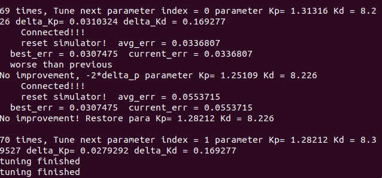

# Udacity-CarND-Controls-PID
  

## Goals
This project implements a PID controller in C++ to maneuver the vehicle's steer angle and throttle around the track.
The simulator will provide  the cross track error (CTE) as input for PID controller. 

## Dependencies

## Simulator
* Simulator. You can download these from the [project intro page](https://github.com/udacity/self-driving-car-sim/releases) in the classroom.

## Dependencies

* cmake >= 3.5
 * All OSes: [click here for installation instructions](https://cmake.org/install/)
* make >= 4.1(mac, linux), 3.81(Windows)
  * Linux: make is installed by default on most Linux distros
  * Mac: [install Xcode command line tools to get make](https://developer.apple.com/xcode/features/)
  * Windows: [Click here for installation instructions](http://gnuwin32.sourceforge.net/packages/make.htm)
* gcc/g++ >= 5.4
  * Linux: gcc / g++ is installed by default on most Linux distros
  * Mac: same deal as make - [install Xcode command line tools]((https://developer.apple.com/xcode/features/)
  * Windows: recommend using [MinGW](http://www.mingw.org/)
* [uWebSockets](https://github.com/uWebSockets/uWebSockets)
  * Run either `./install-mac.sh` or `./install-ubuntu.sh`.
  * If you install from source, checkout to commit `e94b6e1`, i.e.
    ```
    git clone https://github.com/uWebSockets/uWebSockets 
    cd uWebSockets
    git checkout e94b6e1
    ```
  
## Running the Code

1. Clone this repo.
2. Make a build directory: `mkdir build && cd build`
3. Compile: `cmake .. && make`
4. Run it: `./pid`. 
5. Run simulator

# Implementation
## PID Controller

* Propotional component steers the vehicle back to the center. Its output is -1 x proportiona x cte.  
  P alone will lead vehicle prone to overfshoot.
* Integral componet account not only to the cte but also the time for which it has persisted. It accumulates the cte over time.  
  For biased system, it can eliminate this bias. 
* Derivative component aims at flattening the error trajectory into a horizontal line, damping the force applied, and so reduces overshoot
  A pure D controller cannot bring the system to its setpoint
## Paramater Tuning  
#### Tuning Source Code: twiddle.cpp
1. Check system bias, set ```steer = 0```, observe vehicle behavior in simulator.  
     During simulation ```angle = 0``` and vehicle dirves straight forward, therefore system is bias free, integral component is not necessary. 

2. Initial twiddle parameter parameter , ```para = {0.5, 1.0, 0.0}   delta_p = {0.5, 1.0, 0.0}  ```   each test   ```loop_val 450```  
     

3.  Wait tunning process finished when ```delta_p[0]+delta_p[1]) < 0.2```
     

4. Final PID parameter ```Kp = 1.28212  Kd = 8.226```
     


